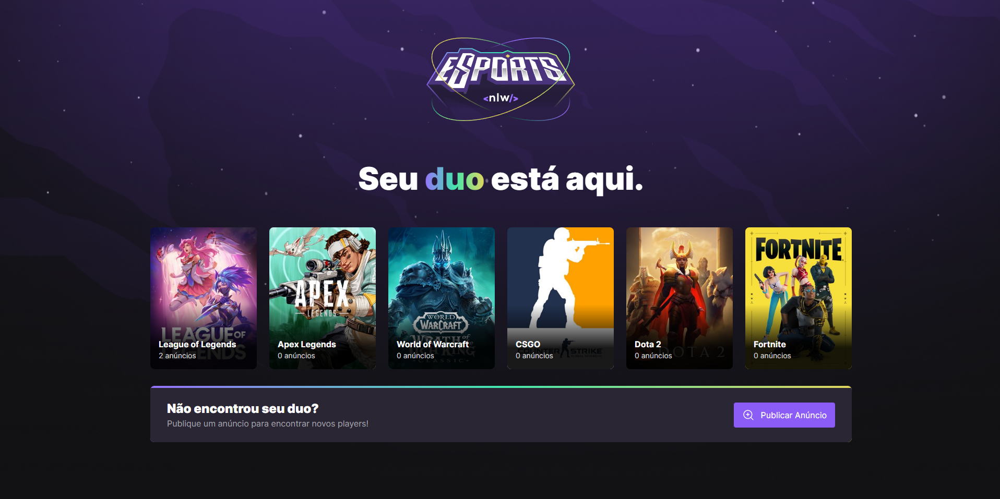

<h1 align="center">
    🚀 NLW eSports
</h1>

<h3 align="center">App Encontre Seu Duo</h3>

 

  
  

## 🚀 Funcionamento

O aplicativo conta com funções de listagem de jogos e anúncios (versão mobile) e cadastro de anúncios. A aplicação foi feita em Node, para o back end, react, para o front end e React Native para a versão mobile..

## 💻 Objetivos

O objetivo da Next Level Week é desenvolver um aplicativo utilizando recursos altamente solicitados pelo mercado, a fim de capacitar o aluno para o trabalho real do dia-a-dia. Durante o período da NLW eSports, tive a oportunidade de participar não só do evento principal mas também da comunidade engajada, que me ajudou diveras vezes com erros que encontrei ao longo do desenvolvimento. No geral, uma experiência incrível e de grande aprendizado!

---

Feito com ♥ by Sofia Rodrigues Ferreira :wave: <a href="https://www.linkedin.com/in/sofiarodfer/">Contato</a>

